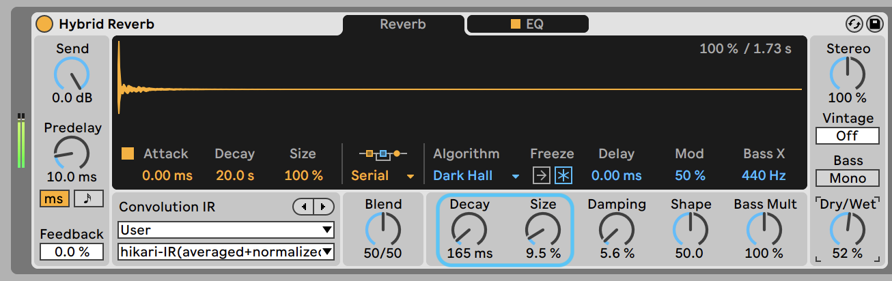
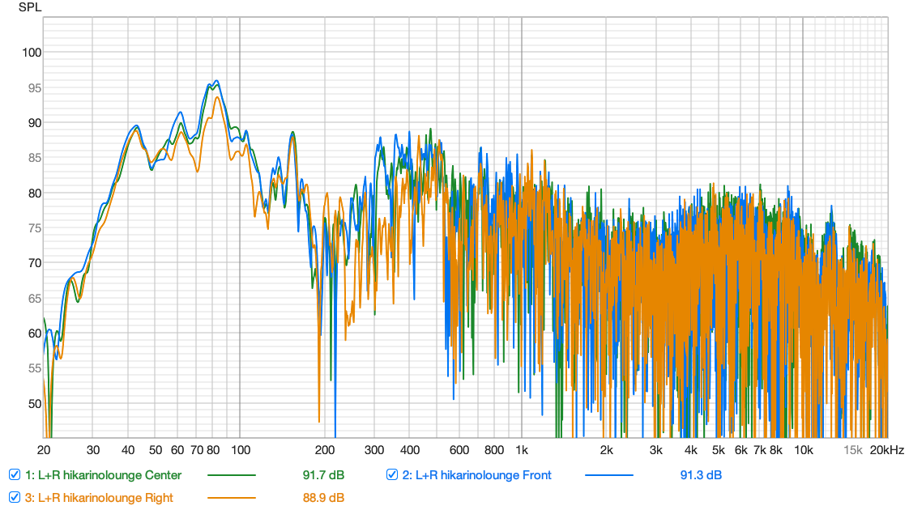
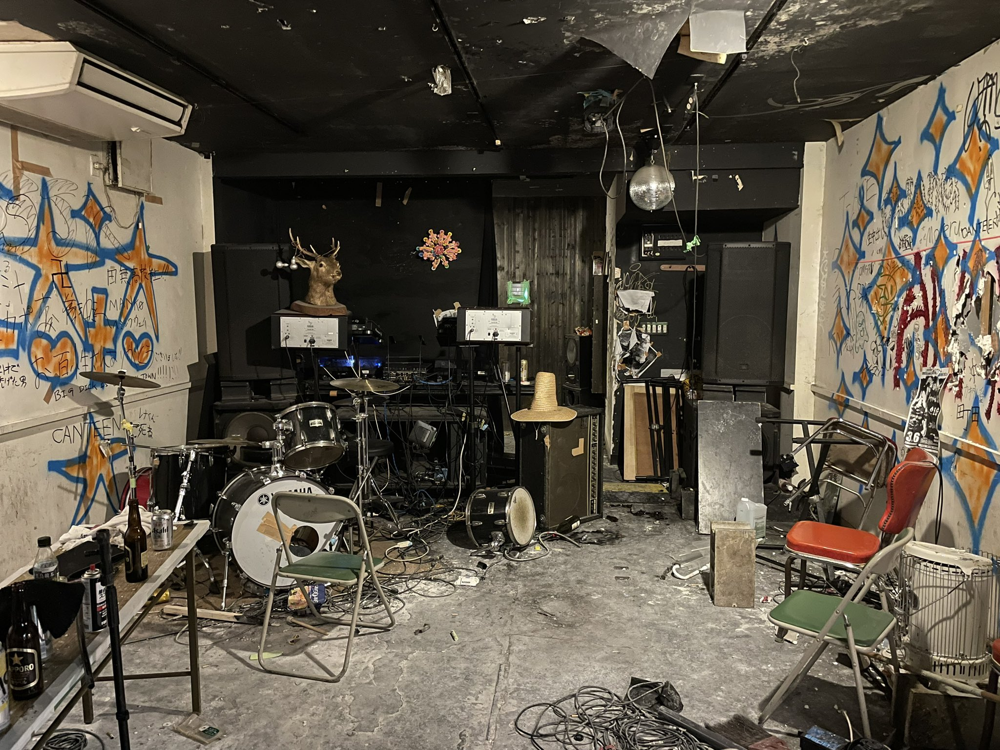

# hikari-no-lounge-IR
ひかりのラウンジのIR(Impulse Response)データ

./wav/  
- hikari-IR(averaged+normalized).wav

## Usage

Ableton liveのHybrid Reverbなどで畳み込んでください。  
"hikari-IR(averaged+normalized).wav"をDrag & Dropするだけでok 👍

※Decayを小さめにするのがオススメ

## 周波数特性

## 測定環境

場所：ひかりのラウンジ 2024/3/23  

マイク：miniDSP UMIK-1  
AUDIO I/O: MOTU M2

./wav/計測データ

- L+R hikarinolounge Center-48k.wav(中央)
- L+R hikarinolounge Front-48k.wav(ちょい前方)
- L+R hikarinolounge Right-48k.wav(ちょい右側)

